位于皮隆亚山的尼考步道和卡尼法尼发洞穴，距离汉密尔顿半个小时车程，路面平整，沿河而上，弯弯曲曲，适合家庭徒步或者骑自行车；卡尼法尼发洞穴全长只有20米，却富有挑战性。详情点击链接：[http://bit.ly/2QXKCEU](http://bit.ly/2QXKCEU)  

日期:19年10月6日，周日
今天我们计划走的是皮隆亚山的尼考步道和卡尼法尼发洞穴，提前到保育部的网站上看了看路线，红心处为停车场，沿着一条小溪（红色箭头所示）一直走到洞穴，然后折返回来。这个路线有点像一个气球，环线部分就是一个长气球，其他部分像系在上面的线。网上标示这条路线不管是骑车还是徒步，都是1级，也就是非常容易。  
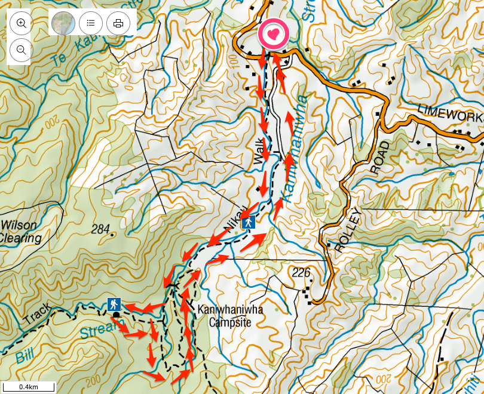
谷歌地图上的评价非常好，91个评价打分4.7，应该可以说又是一个当地人喜欢的非著名景点了。  
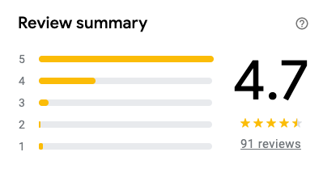
看看上面的照片，停车场附近的这个桥和绿地，夏天的时候真是充满欢乐，这里可以跳水，可以游泳，还有一个绳索秋千，从岸上拉住忽悠一下就跳到了水里。附近还有一个免费的营地，有厕所，有水，有垃圾桶。  
准备就绪，出发。快到的时候，路不是很宽，两边都是山谷，想起来汉密尔顿有条路叫Hillcrest，这不也一样的嘛，山顶之路。导航到Kaniwhaniwha Reserve，十点半的时候到的，人已经很多了，红线标示的区域都可以停车  
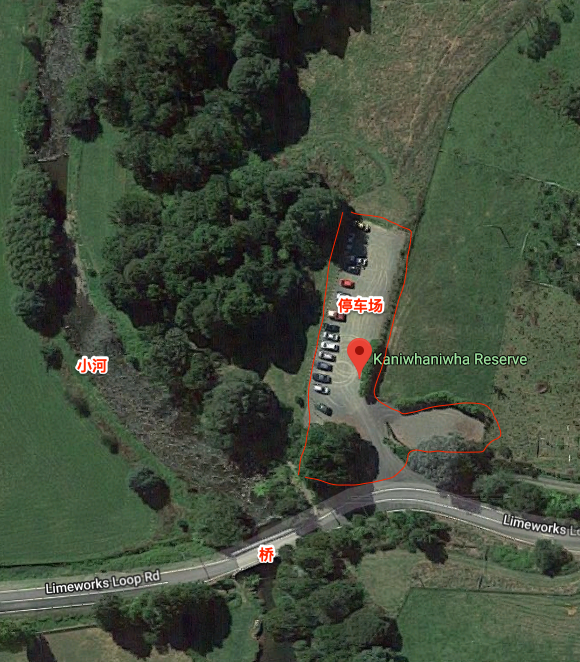
停车场不大，今天人还挺多  
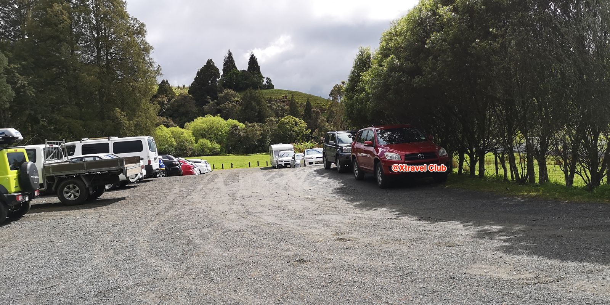
停车场有厕所，里面有卫生纸。   
沿着路牌标示的方向，穿过那条路，经过一个地图和另外一个路牌  
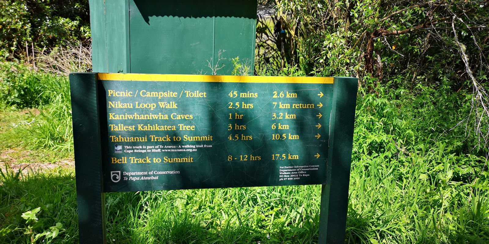
可以看出我们今天要走的Nikau环形步道（第二个）全长7公里，往返约须两个半小时。仅仅只去卡尼法尼法洞穴 (Kaniwhaniwha Caves) 也需要一个小时的样子，而卡尼法尼法洞穴 (Kaniwhaniwha Caves)又在Nikau环形步道中间再往前走10分钟的样子。  
沿着小溪溯流而上进入一片树林和有点泥泞的步道。Nikau步道可供自行车骑行和徒步，所以沿途会看到很多骑行的人。因为难度很小，所以多半是父母带着孩子来玩。
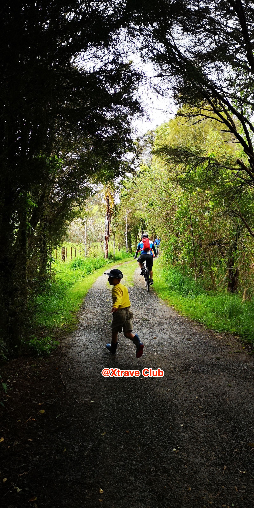
自行车道在树林里，和人行步道在一起，所以你在树林中穿梭的时候，时不时有骑者从身旁经过。

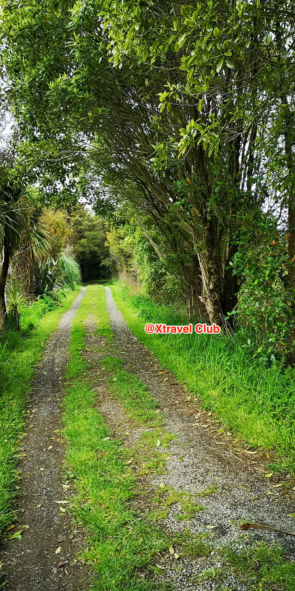

走走玩玩，路边不时有大树和可以驻足的河边区域，小朋友喜欢扔东西进水里；一些钓鳟鱼的人拿着装备走过，没见到有什么渔获。

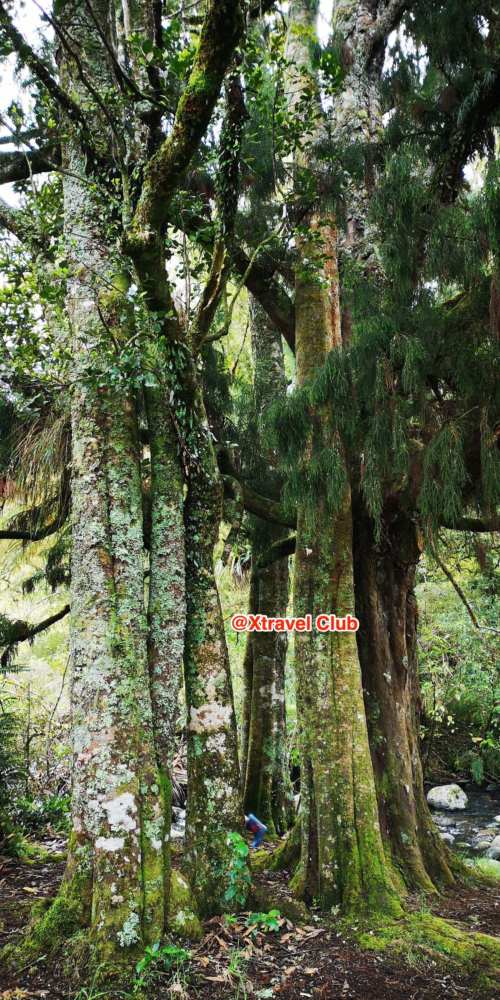

新西兰有很多蕨类植物，耳熟能详的莫过于银蕨，但是黑蕨却更为常见，就像这种，比较高大，树干可以长得很粗，当地人会用这种树干修建整齐当作篱笆使用。

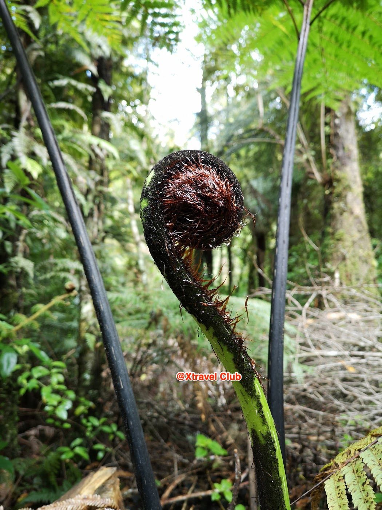

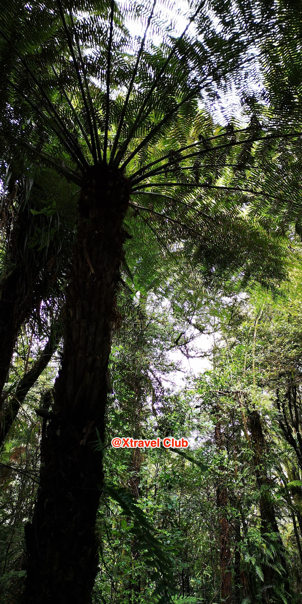

树林中行走，没有太阳的直射，没有虫子的骚扰，还是挺好玩的。当地的很多步道都是这样，简直可以说是人和自然的和谐共处了。

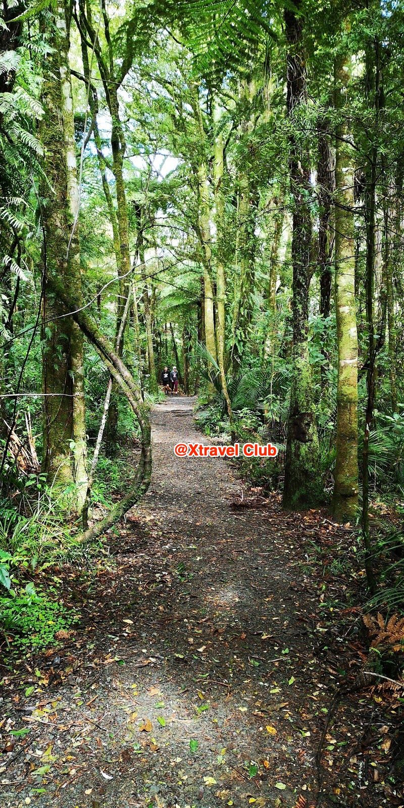

这个步道之所以叫做尼考步道，就是因为周围长了太多的本地植物Nikau，这是一个毛利名字，形容这种树像椰子树，你看它像不像？

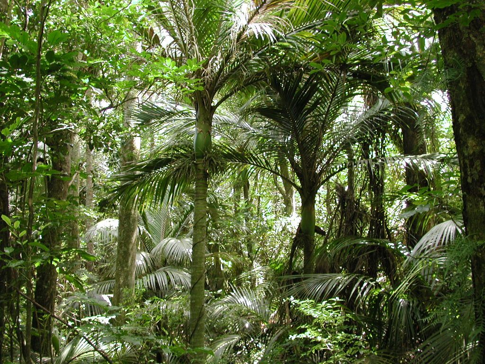

这种树是新西兰本土唯一的棕榈树，南北岛都有分布，最高可以长到15米，毛利人会吃顶部的嫩叶和花骨朵，叶子可以包裹食物，那些外部的干叶子可以用来编织篮子、地毯或者覆盖在房顶遮雨。

走过这个小桥，再走几分钟就到了卡尼法尼发洞穴

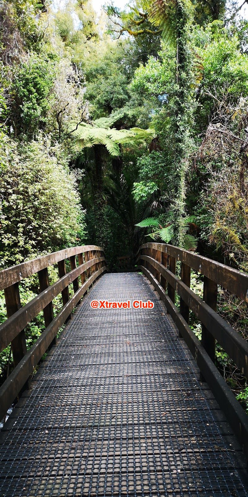

入口的标牌介绍说洞穴长20米，有些地方比较狭窄，可能会有泥巴，推荐15分钟，俯视图和侧视图看起来很有趣，小朋友摩拳擦掌跃跃欲试

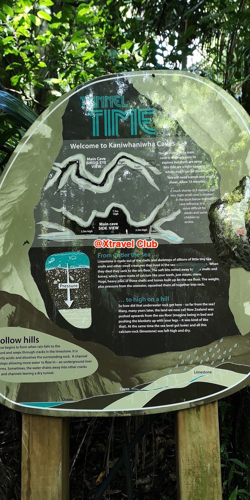

入口处已经占满了一组人，大人小孩都有，他们试探着下去，在里面拍照，说里面太过于黑暗而狭窄。

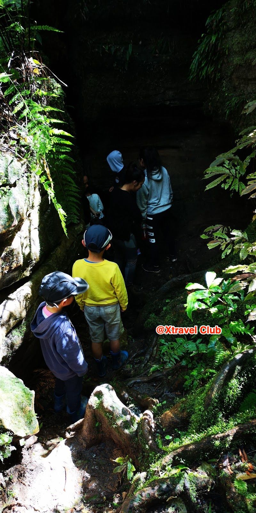

我们一直等待着，因为知道洞穴湿滑，小朋友早已经穿上了胶鞋，我也做好了把鞋子搞湿的的准备。  
他们终于拍照完毕，放弃前行了。  
一下子没人了，轮到我们了，小心翼翼走下去，打开手机的手电，准备探索了！我们总是对未知充满好奇，和一点点恐惧。  
确实很狭窄，仅够一个人侧身而过，急匆匆向前走，不知道前面会有什么。脚下是流水，仅仅能够湿鞋，但是想要沿着两边的石壁行走而不用湿鞋的想法是不现实的，因为太过于湿滑。  
几分钟后，有了光亮，一块钟乳石分割之下，一边弯腰也只能艰难穿过，一边却可以见到天日可以直背走出。只是，最艰苦的却在最后，太过于狭窄，我只能把背包拿下这才侧着身子小心翼翼的走过来。出口处时一个通往外面的梯子   
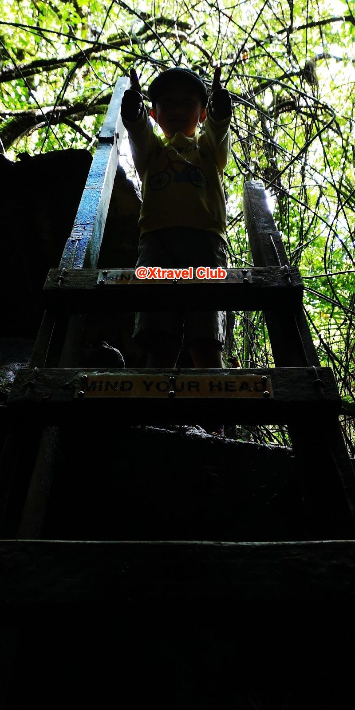

"We did it！" 小朋友们充满兴奋，"可以再来一次么？"  
"可以！"  
"可以再来两次么？"  
"可以！"  
再次进来，没有上次的新鲜和紧张，有了时间好好看看周围的东西，两边石壁湿滑，白色的应该是钟乳石，头顶悬挂着不少钟乳石笋；出口的地方可以看到黄土，所以石壁上也沾有泥泞，怪不得我身上都有泥巴呢。  
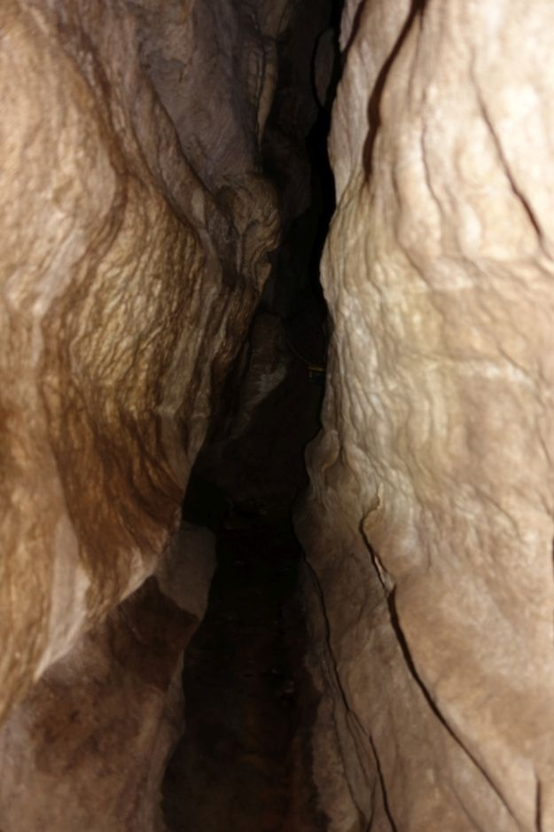

我们走了几遍，终于不想再走了，但对于这种好玩的地方，马上就安排了将来的出行计划，"我们还可以来么？"  
返回到尼考步道，拿出早上准备的三明治，边走边吃边聊：  
-"这个洞穴好玩不？"  
-"好玩！"  
-"我们前面的人拍了照片就走了，多可惜啊"  
-"是啊，他们不知道这么好玩"  
-"他们为什么没有向前走看一看呢？他们拍照的地方，其实已经走了一小半了"  
-"他们不敢吧"  
-"你刚下去的时候是不是也有点害怕？我都有点害怕，好紧张"  
-"是的，里面黑乎乎的"  
-"我们提前也做好了准备，都穿了胶鞋，准备了手机当作手电，所以不太担心"  
-"嗯，他们没有，所以就give up（放弃）了"  
-"所以有些时候，人们放弃，不是因为真的很难，而是因为他们想象那个很难"  
走完环形部分的时候，已经要穿过那个小溪，向右是营地，我们决定去看看。下图中两个小房子是厕所，近处的是垃圾桶  
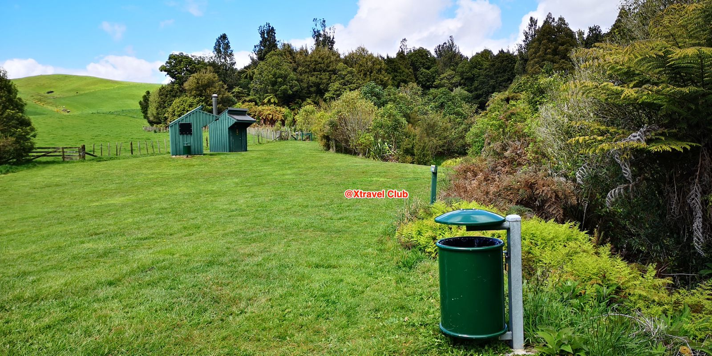

草地平整，有桌椅，远处那个地方是个可以点火的地方，夏天晚上在这里点上篝火一定会很好玩  
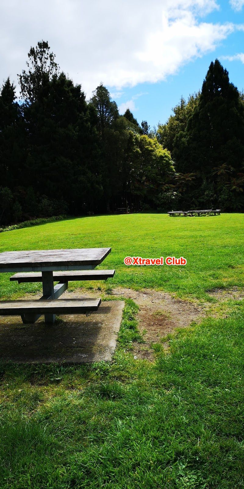
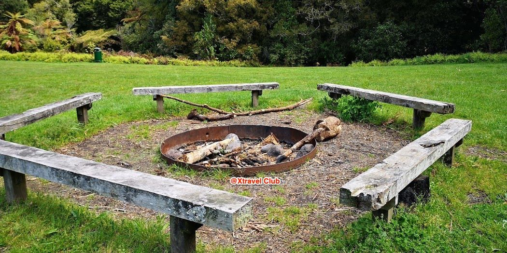

走回停车场，路上太阳已经很热烈，在光影之中穿梭，突然诗意大发："我走在阳光之下，想起你那飘飘的长发"  
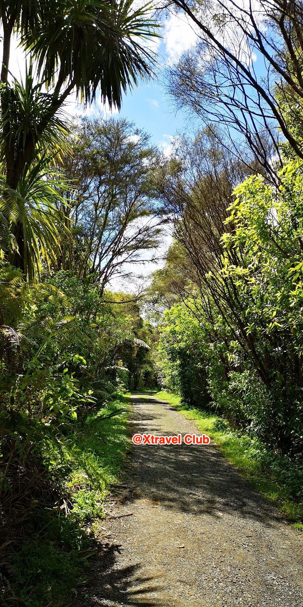

【下次活动预告】
在距离停车场6公里的地方，有一个Kahikatea 树（鸡毛松或者白松，属于罗汉松的一种），高达66.5米，是新西兰最高的鸡毛松了。

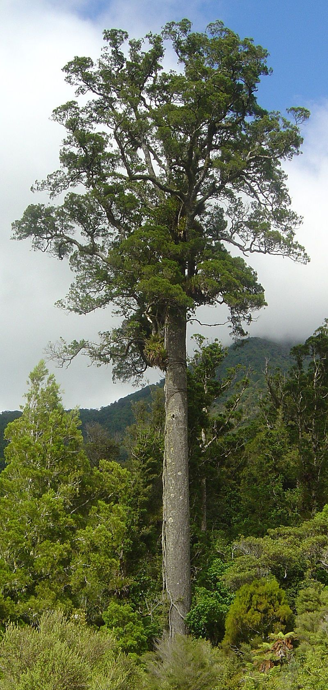

---
## 【联系我们】  
行程定制、包车、机场接送、微留学、亲子游、户外游、订住宿  
快客旅行（Xtravel Club）
PO Box 107129 Auckland Airport  
 Auckland 2150  

Mobile/手机：022 496 4978  
Email/邮箱：[info@xtravel.club](info@xtravel.club)  
Web /网站：[http://xtravel.club](http://xtravel.club )  
微信号/QQ： 496 4978  
扫描关注我们的企业微信号:   
